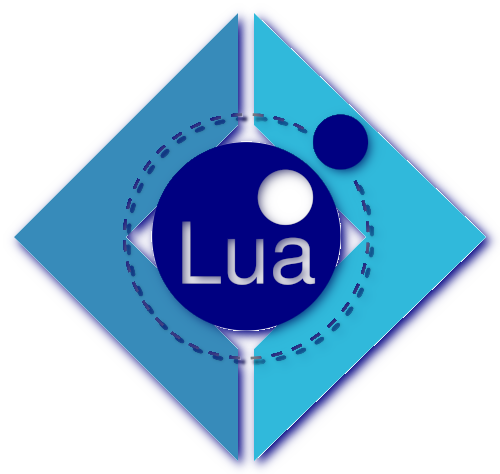

# Fanna

*A cross-platform Lua runtime written in F#*

## Introduction
> __This is an exploratory learning project.__

<a href="https://www.lua.org/">
 

- Lua is a powerful, efficient, lightweight, embeddable scripting language.

</a>

<a href="https://fsharp.org/">
 

- An open-source language that makes it easy to write succinct, robust, and performant code.

</a>

Through .NET Core F#, Lua can be cross-platform and allow interaction with F#. 
Through Fable, Lua can run in the browser and interact with JavaScript.
Of course, it is also compatible with existing Lua.

## Usage
> This project is currently built on [.NET Core 7](https://dotnet.microsoft.com/en-us/download/dotnet/7.0), [Lua5.3](http://www.lua.org/versions.html), and developed on Linux 

### Build and Run
> Building as an executable is currently not supported

### Test
This project carries some Lua test files and will call Lua5.3 during testing to compile these test files into chunks for testing. Therefore, please ensure that Lua5.3 is installed in your build environment, call `lua --version` to check the Lua version, and make `lua5.3` the call name of Lua in the build environment.

- `dotnet build`

## License
The MIT License (MIT)

Copyright (c) 2022 Muqiu Han

Permission is hereby granted, free of charge, to any person obtaining a copy
of this software and associated documentation files (the "Software"), to deal
in the Software without restriction, including without limitation the rights
to use, copy, modify, merge, publish, distribute, sublicense, and/or sell
copies of the Software, and to permit persons to whom the Software is
furnished to do so, subject to the following conditions:

The above copyright notice and this permission notice shall be included in all
copies or substantial portions of the Software.

THE SOFTWARE IS PROVIDED "AS IS", WITHOUT WARRANTY OF ANY KIND, EXPRESS OR
IMPLIED, INCLUDING BUT NOT LIMITED TO THE WARRANTIES OF MERCHANTABILITY,
FITNESS FOR A PARTICULAR PURPOSE AND NONINFRINGEMENT. IN NO EVENT SHALL THE
AUTHORS OR COPYRIGHT HOLDERS BE LIABLE FOR ANY CLAIM, DAMAGES OR OTHER
LIABILITY, WHETHER IN AN ACTION OF CONTRACT, TORT OR OTHERWISE, ARISING FROM,
OUT OF OR IN CONNECTION WITH THE SOFTWARE OR THE USE OR OTHER DEALINGS IN THE
SOFTWARE.